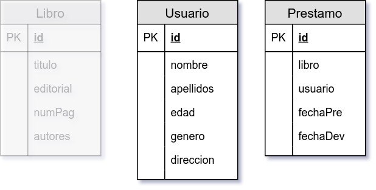
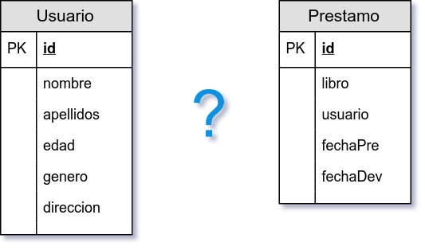
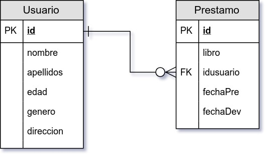

[`Backend Fundamentals`](../../Readme.md) > [`Sesión 05`](../Readme.md) > Ejemplo-02
## Definiendo una relación uno a muchos

### OBJETIVO
Dados los requerimientos de un proyecto y sus tablas conocer el proceso para obtener un diagrama entidad-relación con relaciones uno a muchos.

#### REQUISITOS
1. Descripción del proyecto:

   En una biblioteca requiere de un sistema informático que pueda administrar el préstamo de libros a usuarios, cada libro tiene un título, editorial, número de páginas y un autores asociados.

   Para que un usuario pueda solicitar un préstamo, tiene primero que estar registrarse con los datos de nombre, apellidos, edad, género y dirección.

   Cuando un usuario esta registrado, puede tener en préstamo de 1 a 5 libros por un periodo máximo de 15 días.

1. Modelo de tablas:

   

#### DESARROLLO
1. Para este ejemplo se elijen las dos tablas __Usuario__ y __Prestamo__.
   ***

1. Encontrar la __cardinalidad__ entre la tabla __Usuario__ y la tabla __Prestamo__.

   __Pregunta__

   ¿Un Usuario con cuántos Préstamos está relacionado?    

   __Respuesta__

   Un Usuario está relacionado con 0, 1, 2 o más Préstamos    

   __Pregunta__

   ¿Un Préstamo con cuántos Usuarios está relacionado?    

   __Respuesta__

   Un Préstamo está relacionado con un sólo Usuario 
   ***

1. Definir la relación entre ambas tablas

   __Pregunta__

   ¿Cuál es el tipo de relación entra la tabla __Usuario__ y la tabla __Prestamo__? 

   __Respuesta__

   Es una relación de uno a cero o muchos y en la notación __pata de gallo__ se representa de la siguiente forma: 

   Además en la tabla con cardinalidad muchos, el campo de __usuario__ se convierte en __idusuario__, ya que ahora será el campo que relacione ambas tablas, a este tipo de campos se le asigna la notación FK (Foreign Key) que significa "Llave foranea"
   ***
