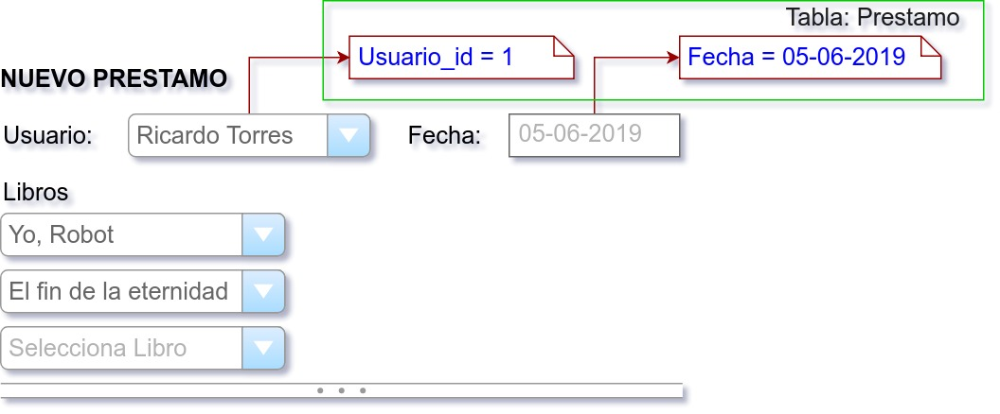

[`Backend con Python`](../../Readme.md) > [`Sesión 06`](../Readme.md) > Ejemplo-04
## Definiendo y agregando datos a una relación muchos a muchos con SQL

### OBJETIVOS
 - Dado un modelo entidad-relación definir las tablas y sus relaciones con SQL
 - Dado un formulario web agregar los datos a las tablas con SQL

### REQUISITOS
1. Contar con la base de datos Biblioteca inicializada y con los datos de conexión:

   - __Host:__ localhost
   - __User:__ Biblioteca
   - __Password:__ Biblioteca
   - __Base de datos:__ Biblioteca

1. Modelo de entidad-relación:

   

1. Carpeta de repo actualizada
1. Usar la carpeta de trabajo `Sesion06/Ejemplo-04`


### DESARROLLO
1. Crea la tabla __Usuario__ usando el archivo `sql/tabla-usuario.sql`:

   ```console
   Sesion06/Ejemplo-04 $ docker exec -i servidorsql mysql -hlocalhost -uBiblioteca -pBiblioteca Biblioteca < sql/tabla-usuario.sql

   Sesion06/Ejemplo-04 $
   ```
   Si no hay mensajes de error, entonces el comando se ha ejecutado con éxito y ahora ya se debe contar con la tabla __Usuario__ creada en la base de datos.

1. Crear las tablas __Prestamo__ y __LibroPrestamo__:

   __Conectándose a la base de datos:__

    ```console
    Sesion06/Ejemplo-04 $ docker exec -it -e LANG=C.UTF-8 servidorsql mysql -hlocalhost -uBiblioteca -pBiblioteca Biblioteca
    [...]
    MariaDB [Biblioteca]>
    ```
    Notar que ahora se agrega la opción `-e LANG=C.UTF-8` para poder agregar datos con caracteres en español a las tablas.

   __Creando la tabla Prestamo:__

   ```sql
   CREATE TABLE Prestamo (id INT PRIMARY KEY AUTO_INCREMENT, idUsuario INT NOT NULL, fechaPre DATE, fechaDev DATE);
   Query OK, 0 rows affected (0.105 sec)
   ```

   __Creando la tabla LibroPrestamo:__

   ```sql
   CREATE TABLE LibroPrestamo (idLibro INT NOT NULL, idPrestamo INT NOT NULL, PRIMARY KEY (idLibro, idPrestamo));
   Query OK, 0 rows affected (0.036 sec)
   ```

   __Validando la creación de las tablas:__

   ```sql
   DESCRIBE Prestamo;
   +-----------+---------+------+-----+---------+----------------+
   | Field     | Type    | Null | Key | Default | Extra          |
   +-----------+---------+------+-----+---------+----------------+
   | id        | int(11) | NO   | PRI | NULL    | auto_increment |
   | idUsuario | int(11) | NO   |     | NULL    |                |
   | fechaPre  | date    | YES  |     | NULL    |                |
   | fechaDev  | date    | YES  |     | NULL    |                |
   +-----------+---------+------+-----+---------+----------------+
   4 rows in set (0.001 sec)

   DESCRIBE LibroPrestamo;
   +------------+---------+------+-----+---------+-------+
   | Field      | Type    | Null | Key | Default | Extra |
   +------------+---------+------+-----+---------+-------+
   | idLibro    | int(11) | NO   | PRI | NULL    |       |
   | idPrestamo | int(11) | NO   | PRI | NULL    |       |
   +------------+---------+------+-----+---------+-------+
   2 rows in set (0.001 sec)
   ```
   ***

1. Agregar los datos del siguiente formulario web a las tablas __Prestamo__ y __LibroPrestamo__:

   __Fomulario:__

   

   __Identificando datos relacionados con la tabla Prestamo:__

   

   __Agregando datos a la tabla Prestamo:__

   ```sql
   INSERT INTO Prestamo VALUES (null, 1, "2019-06-05", null);
   Query OK, 1 row affected (0.001 sec)
   ```

   __Identificando datos relacionados con la tabla LibroPrestamo:__

   

   __Agregando datos a la tabla LibroPrestamo:__

   ```sql
   INSERT INTO LibroPrestamo VALUES (1, 1), (2, 1);
   Query OK, 2 rows affected (0.001 sec)
   Records: 2  Duplicates: 0  Warnings: 0
   ```

   __Validando resultados:__

   ```sql
   select * from Prestamo;
   +----+-----------+------------+----------+
   | id | idUsuario | fechaPre   | fechaDev |
   +----+-----------+------------+----------+
   |  1 |         1 | 2019-06-05 | NULL     |
   +----+-----------+------------+----------+
   1 row in set (0.000 sec)

   select * from LibroPrestamo;
   +---------+------------+
   | idLibro | idPrestamo |
   +---------+------------+
   |       1 |          1 |
   |       2 |          1 |
   +---------+------------+
   2 rows in set (0.000 sec)
   ```

### POR SI ACASO
En la carpeta `sql/` existe los archivos que se pueden usar para restarurar la base de datos o las tablas, según sea el caso como se menciona a continuación.

  - `biblioteca.sql` Permite crear nuevamente la base de datos y el usuario de acceso en caso de ser necesario.
  - `tabla-libro.sql` Permite colocar la tabla Libro a su estado inicial
  - `tabla-usuario.sql` Permite colocar la tabla Usuario a su estado inicial
  - `tablas-final.sql` Permite colocar todas las tablas en el estado final del ejemplo para poder continuar.
